# 0x00 介绍

Shink-the-chunk是一种高级堆利用技巧，主要是对堆的巧妙排布造成overlap chunk,这里通过刚结束不久的RCTF中的BabyHeap和大家一起学习一下这种技巧

# 0x01 原理

	利用条件：存在off-by-null或者其他可以改变下一个chunk size域的漏洞
	目地：制造overlap chunk，进而更改其他chunk的内容
	利用的机制：当前后块空闲时，unsortbin和smallbin会做unlink操作这一特性

## 利用步骤如下

### 第一步

	分配三个堆块，fastbin为空

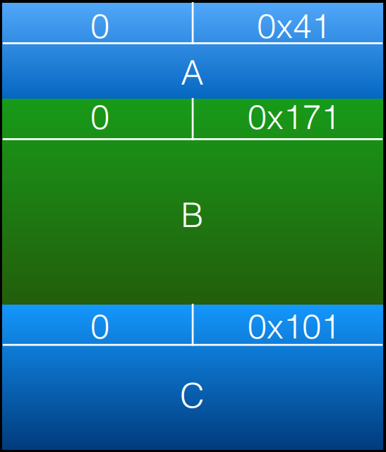

### 第二步

	free(B)

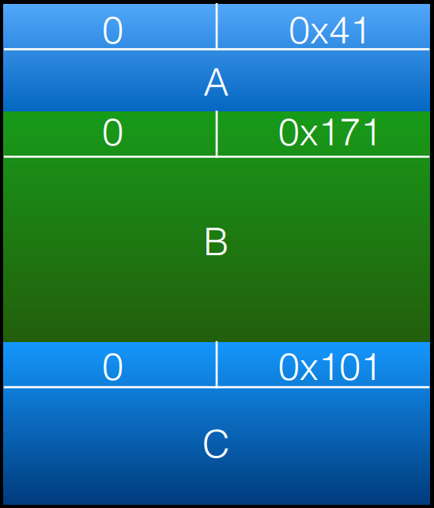

### 第三步

	free(A)

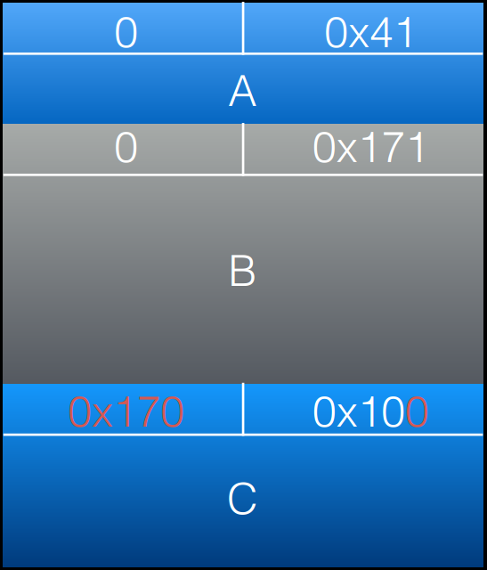

### 第四步

	malloc(0x38)

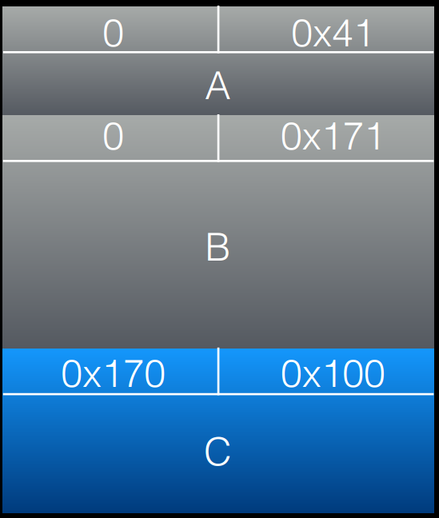

### 第五步

	通过A off-by-one overflow将B的size域最后一字节置0

### 第六步

	malloc(0x80)

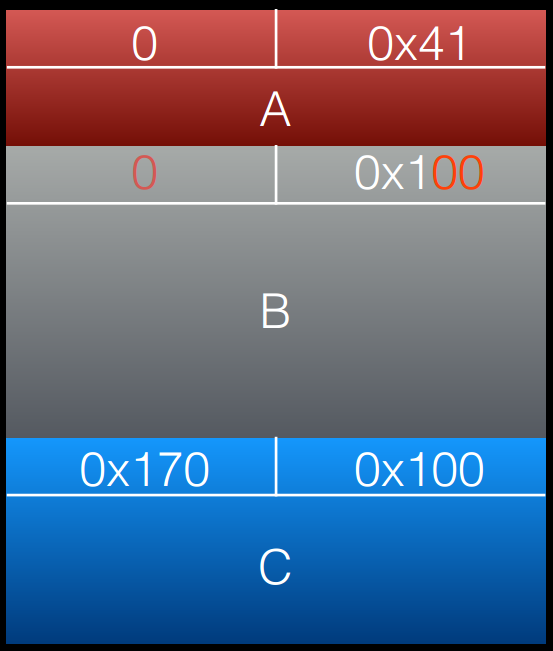

### 第七步

	malloc(0x30)

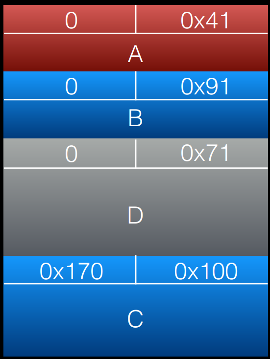

### 第八步

	free(B)

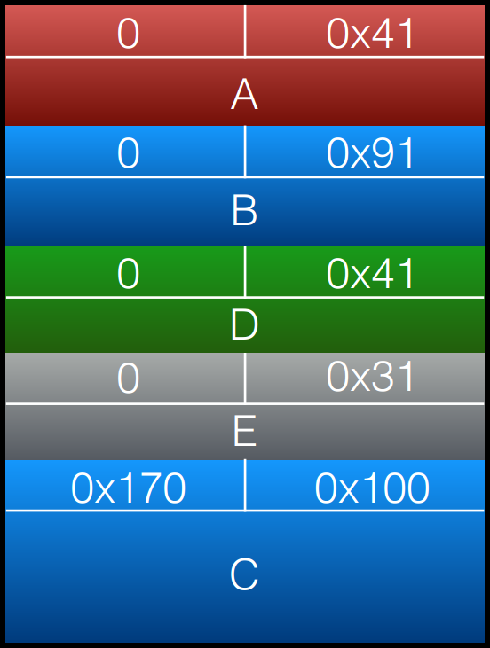

### 第九步

	free(C)

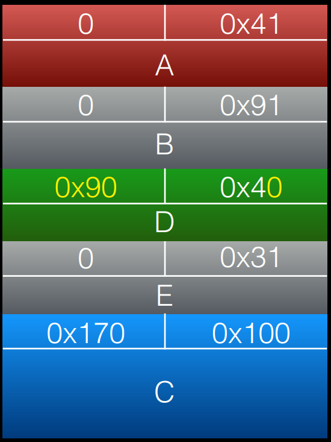

因为 C 是 smallbin的⼤⼩的关系，所以会检测上⼀块chunk是否 inused

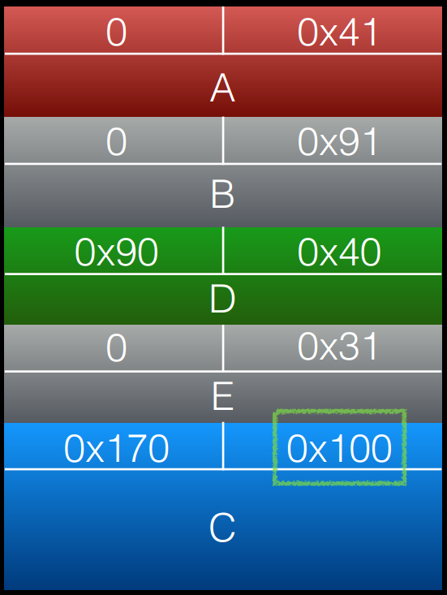

如果上⼀块是 freed 就会根据prev_size去找上⼀块 chunk的 header 做 unlink

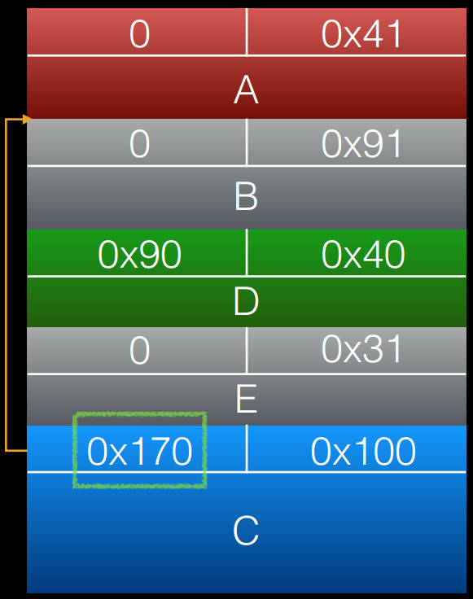

此时 unsortbin 存着这块大 chunk ，所以下次malloc 先分配这⼀块

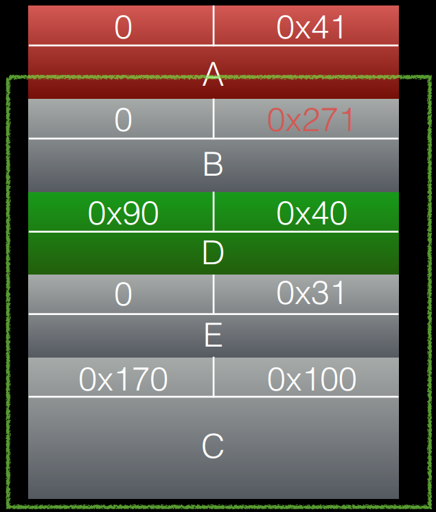

### 最后一步

	malloc(0x260)

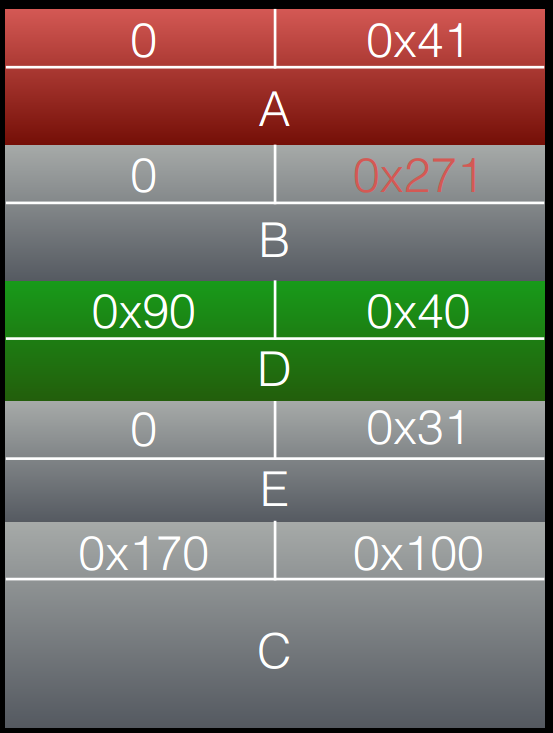

此时可通过新申请的大chunk任意改 D

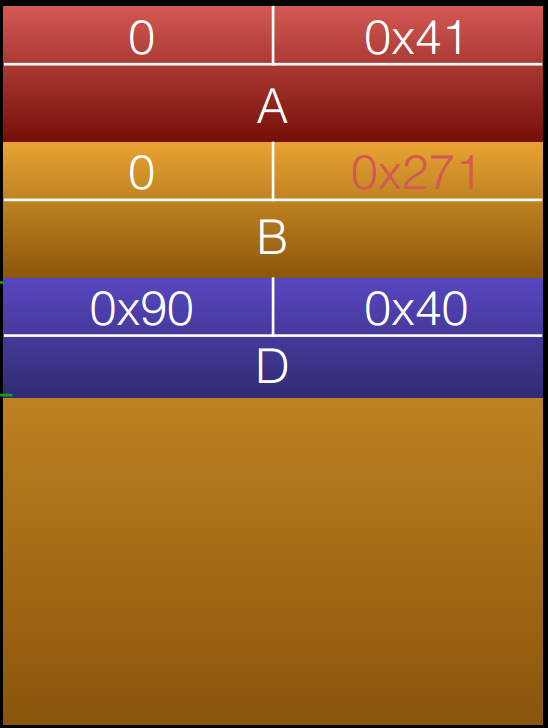

## 结合其他漏洞进行利用

	1.如果中間overlap 部分有 function pointer 或者是其他有⽤的 struct 可间接控制程式流程
	2.可以配合 fastbin freed chunk 更改 fd

# 0x02 RCTF-BabyHeap

题目下载地址：https://github.com/moonAgirl/CTF/tree/master/2018/RCTF/babyheap

在该题中存在off-by-null,可更改下一个chunk的size最后一字节为0

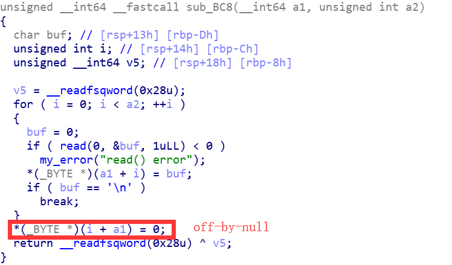

利用off by null来chunk overlap,chunk overlap之后利用fast binattack来get shell

## off by null&chunk overlap

	alloc(0x48,'aaaa')
	alloc(0xf9,'bbbb')
	alloc(0xa8,'cccc')
	alloc(0x100,'dddd')
	
	#-----------off by null-------------
	delete(1)
	delete(0)
	alloc(0x48,'a'*0x48)
	
	
	#----------chunk overlap--------
	alloc(0x88,'1\n')
	alloc(0x68,'4\n')
	
	delete(1)
	delete(2)

具体脚本：https://github.com/moonAgirl/CTF/blob/master/2018/RCTF/babyheap/babyheap.py

# 0x03 总结

除了shrink chunk,还有extend chunk,结果都是造成chunk overlap

